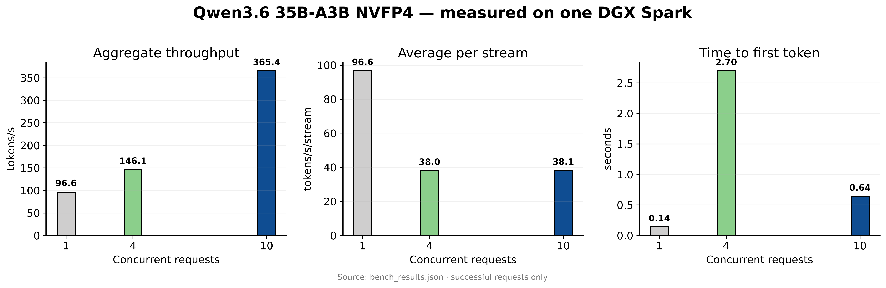

# nvidia/Qwen3.6-35B-A3B-NVFP4 — DGX Spark (GB10)

vLLM deployment package for **nvidia/Qwen3.6-35B-A3B-NVFP4** on NVIDIA DGX Spark / ASUS Ascent GX10 (GB10, SM121).

This is **not** new model weights. Weights stay on Hugging Face. This repo is a tested, ready-to-run serving config:

- vLLM + FlashInfer attention
- NVFP4 MoE via Marlin
- FP8 KV cache
- MTP speculative decoding (3 tokens)
- Qwen3 reasoning parser + tool calling
- **10 concurrent sequences** (`max_num_seqs=10`)

## Benchmark visualization

[](figures/benchmark-summary.pdf)

The figure is generated from this repository's measured results with [`figures/plot_benchmarks.py`](figures/plot_benchmarks.py), following the publication-figure conventions from [figures4papers](https://github.com/ChenLiu-1996/figures4papers). The PNG is optimized for GitHub; click it for the vector PDF.


## Benchmarks (measured on this box)

Host: ASUS Ascent GX10 / NVIDIA GB10  
Image: `eugr/spark-vllm:latest` (vLLM `0.25.1.dev24+g96bb89286`, CUDA 13.0)  
Prompt: short technical question, `max_tokens=256`, `temperature=0.6`, streaming  
Date: 2026-07-11

| Concurrency | Success | Avg TTFT | Aggregate tok/s | Avg tok/s per stream | Wall |
|---|---:|---:|---:|---:|---:|
| 1 | 1/1 | **0.14 s** | **96.6** | 96.6 | 2.65 s |
| 4 | 4/4 | 2.70 s | **146.1** | 38.0 | 7.01 s |
| 10 | 10/10 | **0.64 s** | **365.4** | 38.1 | 7.01 s |

Notes:

- Aggregate tok/s = total completion tokens across all streams / wall clock of that concurrency batch.
- With Qwen3 reasoning parser, most tokens land in `message.reasoning` / stream `delta.reasoning` (thinking is on).
- KV cache after launch: ~**5.97M tokens** (~70.7 GiB). Engine reports theoretical max concurrency at 262k ctx ≈ **22.8x**; this recipe hard-caps at **10** concurrent seqs for a practical multi-session default.

Raw JSON: [`bench_results.json`](./bench_results.json)  
Repro script: [`bench_concurrent.py`](./bench_concurrent.py)

## Quick start

```bash
git clone https://github.com/gitcommit90/nvidia-qwen36-35b-nvfp4-dgx-spark.git
cd nvidia-qwen36-35b-nvfp4-dgx-spark
chmod +x start.sh stop.sh

# optional: HF token for gated/rate-limited downloads
export HF_TOKEN=hf_...

./start.sh
# API: http://127.0.0.1:8000/v1
```

Stop:

```bash
./stop.sh
```

## Serve config (what actually runs)

```bash
vllm serve nvidia/Qwen3.6-35B-A3B-NVFP4 \
  --host 0.0.0.0 \
  --port 8000 \
  --language-model-only \
  --tensor-parallel-size 1 \
  --trust-remote-code \
  --kv-cache-dtype fp8 \
  --attention-backend flashinfer \
  --moe-backend marlin \
  --gpu-memory-utilization 0.65 \
  --max-model-len 262144 \
  --max-num-seqs 10 \
  --max-num-batched-tokens 32768 \
  --enable-chunked-prefill \
  --async-scheduling \
  --enable-prefix-caching \
  --speculative-config '{"method":"mtp","num_speculative_tokens":3,"moe_backend":"triton"}' \
  --load-format fastsafetensors \
  --reasoning-parser qwen3 \
  --tool-call-parser qwen3_coder \
  --enable-auto-tool-choice \
  --default-chat-template-kwargs '{"preserve_thinking":true}' \
  --override-generation-config '{"temperature":0.6,"top_p":0.95,"top_k":20,"min_p":0.0,"presence_penalty":0.0,"repetition_penalty":1.0}'
```

Environment:

```bash
export VLLM_MARLIN_USE_ATOMIC_ADD=1
export HF_HUB_OFFLINE=1          # after first download
export TRANSFORMERS_OFFLINE=1
```

## Why not just sparkrun?

`sparkrun run @spark-arena/...` is a great launcher, but we hit a real footgun packaging this for others:

- sparkrun’s recipe path double-escaped JSON defaults (`{{...}}`) for `--speculative-config` / chat-template / generation config, so vLLM failed to parse them.
- This package writes those JSON blobs to files and loads them into the serve script, which is reliable.

Default concurrent sessions in the original Spark Arena recipe we started from was **4**. This package retunes to **10** and publishes the measured multi-session numbers above.

## OpenAI-compatible smoke test

```bash
curl -s http://127.0.0.1:8000/v1/models | jq .

curl -s http://127.0.0.1:8000/v1/chat/completions \
  -H 'Content-Type: application/json' \
  -d '{
    "model":"nvidia/Qwen3.6-35B-A3B-NVFP4",
    "messages":[{"role":"user","content":"What is 17*19? Think step by step."}],
    "max_tokens":400,
    "stream":false
  }' | jq '.choices[0].message | {content, reasoning}'
```

Thinking is enabled. Clients that only render `content` may hide chain-of-thought; inspect `reasoning` / stream `delta.reasoning`.

## Re-run the concurrent bench

```bash
python3 bench_concurrent.py \
  --base-url http://127.0.0.1:8000 \
  --model nvidia/Qwen3.6-35B-A3B-NVFP4 \
  --levels 1,4,10 \
  --max-tokens 256 \
  --out bench_results.json
```

## Requirements

- NVIDIA DGX Spark / GB10-class machine (SM121)
- Docker with GPU access (`--gpus all`)
- ~25+ GB free for model weights + image
- Hugging Face access to `nvidia/Qwen3.6-35B-A3B-NVFP4`

## Credits

- Model: [nvidia/Qwen3.6-35B-A3B-NVFP4](https://huggingface.co/nvidia/Qwen3.6-35B-A3B-NVFP4)
- Container base used in testing: `eugr/spark-vllm` / Spark Arena ecosystem
- Benchmarks & packaging: measured on Joseph Yaksich’s GB10 box (`tux`)

## License

Apache-2.0 for the scripts/docs in this repo. Model weights retain their upstream licenses.
